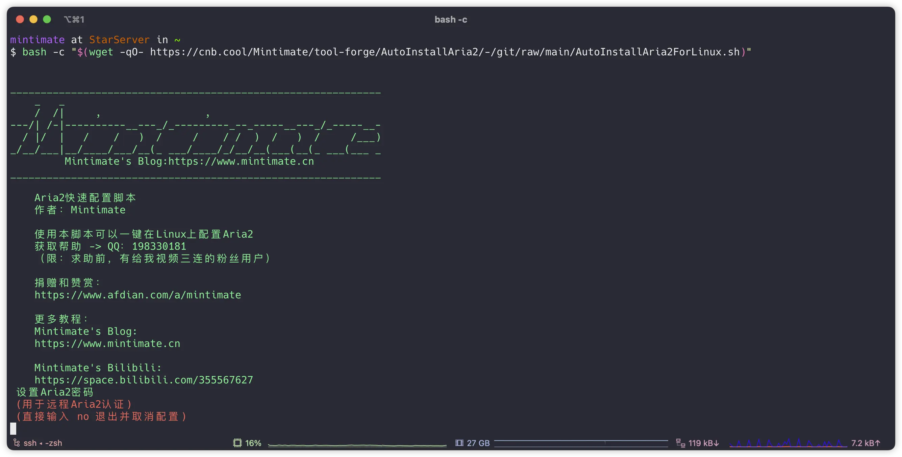
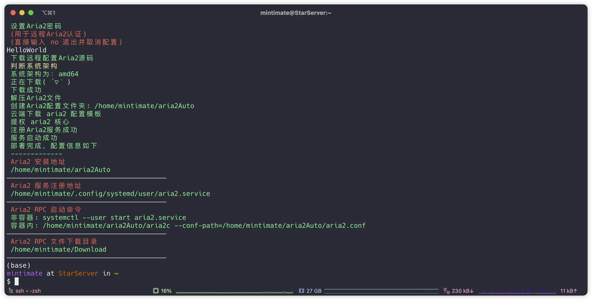
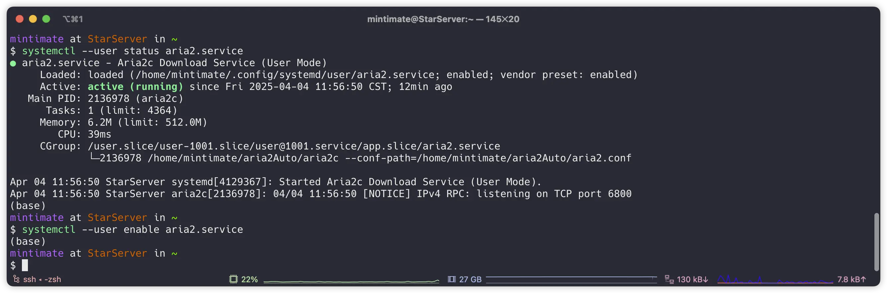

# AutoInstallAria2
Auto Install Aria2 To Linux。
自动配置安装 Aria2 到 Linux 服务器或者 Linux 发行版里。

## 一键配置安装
```bash
bash -c "$(wget -qO- https://cnb.cool/Mintimate/tool-forge/AutoInstallAria2/-/git/raw/main/AutoInstallAria2ForLinux.sh)"
```





### 配置文件

一键安装后，默认在`$HOME/aria2Auto`下生成配置文件`aria2.conf`等文件:
```bash
mintimate at StarServer in ~/aria2Auto
$ tree
.
├── aria2c
├── aria2.conf
└── deleteAria2.conf
```

使用`systemctl`管理 Aria2 服务:



当前版本使用的是 [aria2c 1.37.0_Turbo 版本](https://cnb.cool/flyinbug/aria2-static-build)。是一个修改版本，突破最大线程数限制。**你可以修改`aria2.conf`文件里的`max-concurrent-downloads`参数，来修改最大线程数**。

> 也就是，官方编译的版本，最大线程数是 16，而这个版本，最大线程数是可以突破。

## Docker 部署

当前支持 ARM64 和 AMD64 架构的 Docker 包:
```bash
docker run -d --name aria2 -p 6800:6800 -v ~/Downloads:/app/Downloads docker.cnb.cool/mintimate/tool-forge/autoinstallaria2
```
其中:
- `-p 6800:6800`：将容器内的 6800 端口映射到宿主机的 6800 端口;
- `-v ~/Downloads:/app/Downloads`：将宿主机上的`~/Downloads`目录映射到容器内的`/app/Downloads`目录。

RPC 初始密码获取:
```bash
docker exec -it 38c0a4e3374f cat /app/initAria2Password
```

如果你想自定义密码，已经预留了`RPC_SECRET`环境变量:
```bash
docker run -d --name aria2 -p 6800:6800 -v ~/Downloads:/app/Downloads -e RPC_SECRET="Mintimate" docker.cnb.cool/mintimate/tool-forge/autoinstallaria2
```
此时，RPC 密码为`Mintimate`。

## 卸载
如果需要卸载该脚本所安装的一切 Aria2，只需要：
```bash
rm -rf $HOME/aria2Auto
systemctl --user disable aria2
systemctl --user stop aria2
rm -rf ~/.config/systemd/user/aria2.service
```

删除后，无其他残留文件。

## Licence

[](LICENSE)

## Donate

爱发电: [https://afdian.com/@Mintimate](https://afdian.com/@Mintimate)
Bilibili: [https://space.bilibili.com/355567627](https://space.bilibili.com/355567627)