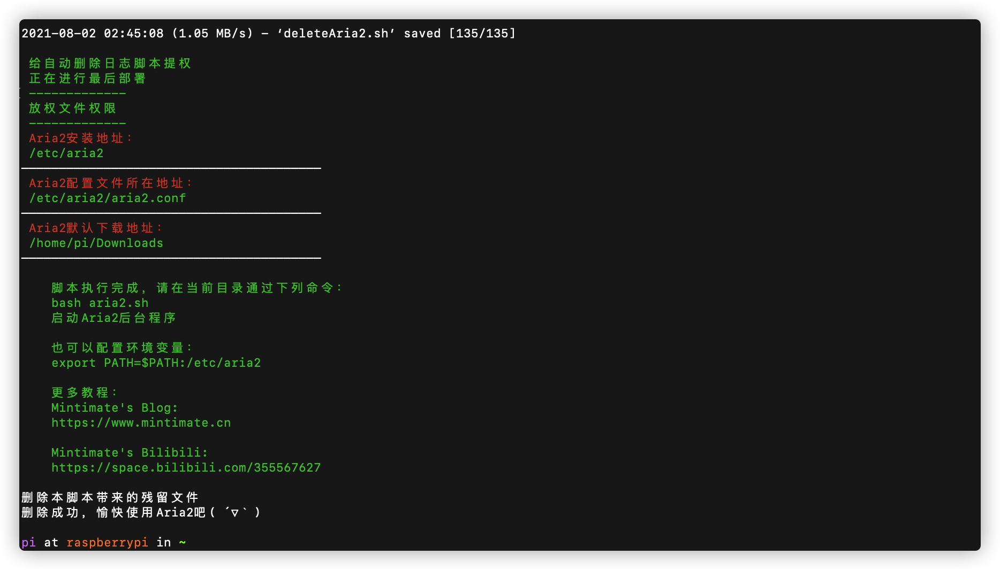
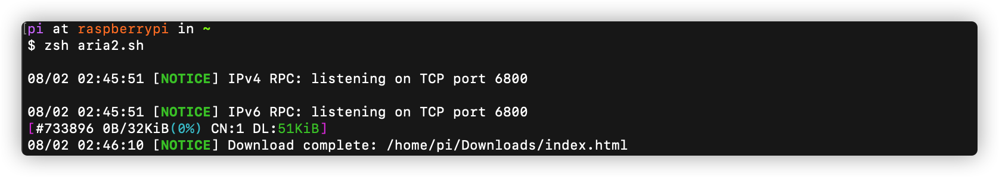

# AutoInstallAria2
 Auto Install Aria2 To Linux
自动配置安装Aria2到Linux服务器或者Linux发行版里

# 一键配置安装
```
wget "https://cdn.jsdelivr.net/gh/Mintimate/AutoInstallAria2@latest/AutoInstallAria2ForLinux.sh" && bash AutoInstallAria2ForLinux.sh
```



# 配置文件
## 安装位置
安装后：
- Aria2安装位置：`/etc/aria2`
- Aria2配置文件：`/etc/aria2/aria2.conf`

## 启动Aria2
在当前用户的家($HOME)目录下，会自动创建一个`aria2.sh`脚本，该脚本用来快捷启动Aria2进程的交互模式，如：

脚本内容：
```
/etc/aria2/aria2c --conf-path=/etc/aria2/aria2.conf
```

启动脚本，使用`/etc/aria2/aria2.conf`这个配置文件。默认下载地址：`${HOME}/Downloads`。**如果想要更改下载地址，请修改/etc/aria2/aria2.conf`这个配置文件**。

## aria2c
你在Terminal内，无法使用aria2命令，如果需要使用aria2命令，两个办法：
### 方法一：进入aria2安装目录
进入aria2的安装目录，即可使用：
```
cd /etc/aria2
```
### 方法二：配置环境变量
配置aria2c进入环境变量即可：
```
export PATH=$PATH:/etc/aria2
```
# 卸载
如果需要卸载该脚本所安装的一切Aria2，只需要：
```
sudo rm -rf /etc/aria2
```
删除后，无其他残留文件。

镜像仓库：
https://gitee.com/mintimate/auto-install-aria2
主要用于国内服务器
